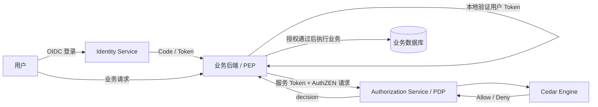

# Rust Cedar IAM 产品设计

> 一个以 **OIDC 提供统一身份**、以 **OpenID AuthZEN 提供标准授权接口**、以 **Cedar 执行细粒度权限策略** 的多租户 Rust IAM。

## 1. 产品定位

本项目同时解决：

- **认证（Authentication）**：用户是谁，如何登录，如何获得可信身份。
- **授权（Authorization）**：用户能否对某个业务资源执行某个操作。

核心差异不是“再做一个 Rust 登录系统”，而是将以下能力完整连接：

```text
OIDC       → 统一身份与登录
AuthZEN    → 标准授权接口
Cedar      → 细粒度策略与授权决策
Rust SDK   → 低成本业务接入
```

核心目标：

> 将身份、权限策略和授权决策从业务代码中抽离，同时保持标准接口、清晰边界和多租户隔离。

---

## 2. 总体架构



系统分为两个平面：

### Identity Plane

负责回答：**当前用户是谁？**

包含用户、组织、应用、登录、SSO、OIDC、JWT、Session 和 JWKS。

### Authorization Plane

负责回答：**某个 Subject 能否对某个 Resource 执行某个 Action？**

包含 AuthZEN API、Cedar Schema、Policy、Entity、策略模拟和决策日志。

---

## 3. 核心角色

| 角色 | 含义 | 示例 |
|---|---|---|
| User | 使用业务系统的终端用户 | Alice |
| Organization | 租户边界 | Quant Org |
| Application | 接入 IAM 的业务系统 | Factor Platform |
| PEP | 发起授权请求并执行结果的业务后端 | Factor Server |
| PDP | 计算授权结果的中心服务 | AuthZEN Service |
| Cedar Engine | 根据策略返回 Allow / Deny | `cedar-policy` |

必须区分两种身份：

### 用户身份

用户通过 OIDC 登录获得用户 Token，用于证明“当前用户是谁”。

```json
{
  "sub": "user_alice",
  "organization_id": "org_quant",
  "aud": "factor-platform"
}
```

### 应用身份

业务后端通过 Client Credentials 获得服务 Token，用于证明“谁在调用 AuthZEN”。

```json
{
  "sub": "factor-server",
  "application_id": "factor-platform",
  "scope": "authzen:evaluate"
}
```

AuthZEN 接口默认只允许已注册且具有对应 Scope 的 Application 或 Service Account 调用，不允许匿名调用，也不允许普通组织成员直接调用。

---

## 4. 核心模块

| 模块 | 主要职责 |
|---|---|
| User | 用户资料、状态、密码凭证、外部身份绑定 |
| Authentication | 密码登录、GitHub OAuth、Session、登出、Token 撤销 |
| Organization | 多租户、成员、Owner/Admin/Member |
| Application | OAuth Client、Redirect URI、Client Secret、Scope、Audience |
| OIDC Provider | Authorization Code + PKCE、Token、UserInfo、Discovery、JWKS |
| Service Identity | Client Credentials、Service Account、服务 Scope |
| AuthZEN PDP | 接收标准授权请求并返回授权决策 |
| Cedar Policy | Schema、Policy、Entity、验证、版本、发布和回滚 |
| Policy Simulator | 发布前模拟授权结果并解释原因 |
| Decision Log | 记录授权请求、结果、命中策略和耗时 |
| Rust SDK | 服务 Token 缓存、AuthZEN 调用、错误转换和请求追踪 |

### Organization 规则

```text
Organization
├── Owner
├── Admin
└── Member
```

- 一个组织允许多个 Owner。
- 用户可以加入多个组织。
- 用户在不同组织中可以拥有不同角色。
- 用户、应用、策略和日志必须按组织隔离。
- 第一版中，一个 Application 默认属于一个 Organization。

---

## 5. 业务系统接入流程

### 5.1 注册 Application

管理员在 IAM 创建业务应用：

```text
Application: Factor Platform
Client ID: factor-server
Redirect URI: https://factor.example.com/callback
Scopes:
- openid
- profile
- authzen:evaluate
```

IAM 提供 OIDC Discovery、JWKS、`client_id`、`client_secret` 和 AuthZEN PDP 地址。

### 5.2 用户登录

```text
用户
  ↓
业务系统
  ↓ 跳转
IAM 登录页
  ↓ 登录成功
Authorization Code
  ↓
业务后端换取 ID Token、Access Token、Refresh Token
```

### 5.3 业务请求

用户请求：

```http
DELETE /api/factors/factor-123
Authorization: Bearer <user-access-token>
```

业务后端：

1. 本地验证 JWT 的签名、`iss`、`aud` 和 `exp`。
2. 提取当前用户。
3. 从业务数据库读取可信的资源属性。
4. 使用服务 Token 调用 AuthZEN。
5. 根据 `decision` 放行或返回 `403 Forbidden`。
6. 授权通过后继续执行正常业务规则。

### 5.4 AuthZEN 请求

```http
POST /access/v1/evaluation
Authorization: Bearer <service-access-token>
Content-Type: application/json
```

```json
{
  "subject": {
    "type": "User",
    "id": "user_alice",
    "properties": {
      "organization_id": "org_quant"
    }
  },
  "action": {
    "name": "factor.delete"
  },
  "resource": {
    "type": "Factor",
    "id": "factor-123",
    "properties": {
      "organization_id": "org_quant",
      "owner_id": "user_alice"
    }
  },
  "context": {
    "request_time": "2026-07-13T13:00:00+08:00",
    "source_ip": "203.0.113.10"
  }
}
```

说明：

- Subject/Resource Properties 描述用户和资源本身。
- Context 只存放本次请求特有的信息，例如时间、IP、设备和认证强度。
- Resource Properties 必须由业务后端从数据库中读取，不能直接信任浏览器提交的数据。

返回：

```json
{
  "decision": true
}
```

业务后端必须执行结果：`true` 继续，`false` 拒绝。

---

## 6. AuthZEN 与 Cedar

映射关系：

```text
AuthZEN Subject  → Cedar Principal
AuthZEN Action   → Cedar Action
AuthZEN Resource → Cedar Resource
AuthZEN Context  → Cedar Context
```

Cedar Policy 示例：

```cedar
permit (
    principal,
    action == Action::"factor.delete",
    resource is Factor
)
when {
    principal.organization == resource.organization
    && (
        principal == resource.owner
        || principal in resource.organization.admins
    )
};
```

Cedar 返回 `Allow` 或 `Deny`，IAM 再转换为 AuthZEN Decision。

设计原则：

- 默认拒绝，没有明确 `permit` 即为 `Deny`。
- `forbid` 优先于 `permit`。
- Policy 必须通过 Schema Validation 后才能发布。
- Policy 与业务代码分离，可独立修改、版本化和审计。
- Decision Context 可以附带命中策略和拒绝原因，但不能改变标准 `decision` 的语义。

---

## 7. 系统边界

### IAM 负责

- 用户、组织、应用
- 登录、SSO、OIDC/OAuth 2.0
- Token、Session、JWKS
- Service Identity
- AuthZEN Authorization API
- Cedar Schema、Policy、Entity
- 策略模拟、授权决策和审计

### 业务系统负责

- 本地验证用户 Token
- 将业务操作映射为 Subject、Action、Resource、Context
- 从业务数据库读取可信资源属性
- 调用 AuthZEN 并执行授权结果
- 保存订单、项目、因子等业务数据
- 执行业务状态检查和普通业务规则

例如：

```text
AuthZEN / Cedar：Alice 是否拥有退款权限？
Order Server：订单是否已退款？退款金额是否合法？
```

不要把普通业务规则全部放进 Cedar。

---

## 8. 多租户与安全边界

所有核心资源必须具有 Organization 边界：

```text
Organization
├── Members
├── Applications
├── OAuth Clients
├── Cedar Schemas
├── Cedar Policies
├── Cedar Entities
└── Decision Logs
```

授权前先执行租户边界检查：

1. 从服务 Token 获取 `application_id`。
2. 从服务端数据确认 Application 所属 Organization。
3. 确认 Subject 和 Resource 位于允许访问的租户范围。
4. 通过后再执行 Cedar。

不得只依赖客户端提交的 `organization_id` 判断租户边界。

---

## 9. API 范围

### OIDC/OAuth 2.0

```text
GET  /.well-known/openid-configuration
GET  /.well-known/jwks.json
GET  /oauth2/authorize
POST /oauth2/token
GET  /oauth2/userinfo
POST /oauth2/logout
```

第一版支持：

- Authorization Code + PKCE
- Access Token
- ID Token
- Refresh Token
- Client Credentials
- JWT 与 JWKS

### AuthZEN

第一版：

```text
POST /access/v1/evaluation
POST /access/v1/evaluations
```

后续：

```text
POST /access/v1/search/subject
POST /access/v1/search/resource
POST /access/v1/search/action
```

---

## 10. Rust SDK

示例：

```rust
authzen
    .require_allowed(
        Subject::user(user.id),
        Action::new("factor.delete"),
        Resource::new("Factor", factor.id)
            .property("organization_id", factor.organization_id)
            .property("owner_id", factor.owner_id),
    )
    .await?;
```

SDK 负责：

- 获取、缓存和刷新服务 Token
- 调用 AuthZEN API
- 传递 `X-Request-ID`
- 将 `decision = false` 转换为统一授权错误
- 处理超时、重试和网络错误

后续提供 Axum Extractor、Tower Layer、Java SDK 和 Go SDK。

---

## 11. 技术栈

### Backend

- Rust
- Axum
- Tokio
- Tower
- Serde
- SQLx
- PostgreSQL
- `cedar-policy`
- Tracing

### Security

- Argon2id：密码哈希
- JOSE/JWT：Access Token、ID Token
- 非对称密钥：JWT 签名和 JWKS
- OAuth 2.0 / OpenID Connect
- Authorization Code + PKCE
- Client Credentials

### 核心数据表

```text
users
credentials
external_identities
organizations
organization_members
applications
oauth_clients
sessions
authorization_codes
refresh_tokens
cedar_schemas
cedar_policies
cedar_policy_versions
cedar_entities
decision_logs
```

---

## 12. 第一版范围

### 必须实现

身份：

- User、Organization、Owner/Admin/Member
- Application、OAuth Client、Service Identity
- 用户名/邮箱 + 密码登录
- GitHub OAuth 登录
- OIDC Discovery
- Authorization Code + PKCE
- Access Token、ID Token、Refresh Token
- Client Credentials、JWKS

授权：

- AuthZEN Access Evaluation API
- AuthZEN Access Evaluations API
- Cedar Schema、Policy、Entity
- Policy Validation
- Policy Simulator
- Policy 版本管理
- Decision Log

接入：

- Rust SDK
- Axum 示例项目
- 完整登录与授权示例

### 暂不实现

- LDAP、SAML、SCIM
- 大量第三方登录方式
- 复杂 MFA
- Kubernetes Operator
- 多区域部署
- 本地 Authorization Agent
- AuthZEN Search API
- 复杂业务 Entity 自动同步

---

## 13. 安全原则

1. 默认拒绝，授权异常时 Fail Closed。
2. AuthZEN 接口必须验证调用 Application 的身份。
3. 用户 Token 和服务 Token 必须区分 Audience 与 Scope。
4. Client Secret 不得明文保存。
5. Access Token 短时有效，Refresh Token 支持轮换和撤销。
6. Cedar Policy 必须验证通过后才能发布。
7. 租户边界检查优先于 Cedar 执行。
8. 日志不得记录密码、Token、Authorization Code 和 Client Secret。
9. 支持 `X-Request-ID`，便于跨服务追踪授权请求。
10. 对 AuthZEN 接口进行超时、限流和审计。

---

## 14. 一句话定位

> 一个以 OIDC 提供统一身份、以 AuthZEN 提供标准授权接口、以 Cedar 执行细粒度权限策略的 Rust IAM。

核心关键词：

```text
Rust Native
Cedar Native
AuthZEN Compatible
Multi-tenant by Design
Policy as Code
Explainable Authorization
Developer Friendly
```

---

## 15. 参考规范

- [OpenID AuthZEN Authorization API 1.0](https://openid.net/specs/authorization-api-1_0.html)
- [OpenID AuthZEN Working Group](https://openid.net/wg/authzen/)
- [Cedar Policy Language Documentation](https://docs.cedarpolicy.com/)
- [Cedar GitHub Repository](https://github.com/cedar-policy/cedar)
